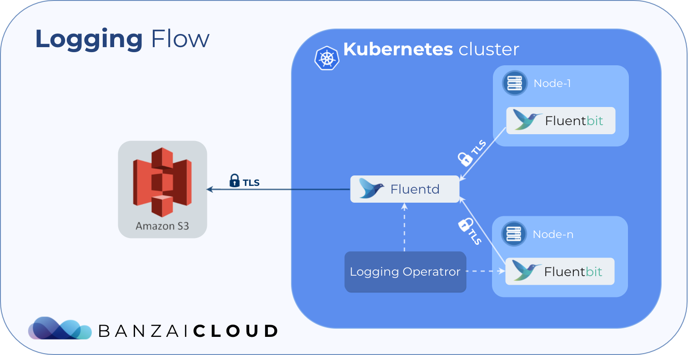

<p align="center"></p>
<p align="center">

  <a href="https://hub.docker.com/r/banzaicloud/logging-operator/">
    
  </a>

  <a href="https://hub.docker.com/r/banzaicloud/logging-operator/">
    
  </a>

  <a href="https://circleci.com/gh/banzaicloud/logging-operator">
    
  </a>

  <a href="https://goreportcard.com/badge/github.com/banzaicloud/logging-operator">
    
  </a>

  <a href="https://github.com/banzaicloud/logging-operator/">
    
  </a>

</p>


# logging-operator

Logging operator for Kubernetes based on Fluentd and Fluent-bit. For more details please follow up with this [post](https://banzaicloud.com/blog/k8s-logging-operator/).

Logging-operator is a core part of the [Pipeline](https://beta.banzaicloud.io) platform, a Cloud Native application and devops platform that natively supports multi- and hybrid-cloud deployments with multiple authentication backends. Check out the developer beta:
 <p align="center">
   <a href="https://beta.banzaicloud.io">
   
   </a>
 </p>

## What is this operator for?

This operator helps you to pack together logging information with your applications. With the help of Custom Resource Definition you can describe the behaviour of your application within its charts. The operator does the rest.

## Installing the operator

```
# Create all the CRDs used by the Operator
kubectl create -f deploy/crds/logging_v1alpha1_plugin_crd.yaml
kubectl create -f deploy/crds/logging_v1alpha1_fluentbit_crd.yaml
kubectl create -f deploy/crds/logging_v1alpha1_fluentd_crd.yaml

# If RBAC enabled create the required resources
kubectl create -f deploy/clusterrole.yaml 
kubectl create -f deploy/clusterrole_binding.yaml
kubectl create -f deploy/service_account.yaml

# Create the Operator
kubectl create -f deploy/operator.yaml

# Create the fluent-bit daemonset by submiting a fluent-bit CR
kubectl create -f deploy/crds/logging_v1alpha1_fluentbit_cr.yaml

# Create the fluentd deployment by submitting a fluentd CR
kubectl create -f deploy/crds/logging_v1alpha1_fluentd_cr.yaml

```

## Example

The following steps set up an example configuration for sending nginx logs to S3.

<p align="center"></p>

### Create Secret

Create a manifest file for the AWS access key:

```
apiVersion: v1
kind: Secret
metadata:
  name: loggings3
type: Opaque
data:
  awsAccessKeyId: <base64encoded>
  awsSecretAccesKey: <base64encoded>
```

Submit the secret with kubectl:

```
kubectl apply -f secret.yaml
```

### Create LoggingOperator resource

Create a manifest that defines that you want to parse the nginx logs with the specified regular expressions on the standard output of pods with the `app: nginx` label, and store them in the given S3 bucket.

```
apiVersion: "logging.banzaicloud.com/v1alpha1"
kind: "Plugin"
metadata:
  name: "nginx-logging"
  labels:
    release: test
spec:
  input:
    label:
      app: nginx
  filter:
    - type: parser
      name: parser-nginx
      parameters:
        - name: format
          value: '/^(?<remote>[^ ]*) (?<host>[^ ]*) (?<user>[^ ]*) \[(?<time>[^\]]*)\] "(?<method>\S+)(?: +(?<path>[^\"]*) +\S*)?" (?<code>[^ ]*) (?<size>[^ ]*)(?: "(?<referer>[^\"]*)" "(?<agent>[^\"]*)")?$/'
        - name: timeFormat
          value: "%d/%b/%Y:%H:%M:%S %z"
  output:
    - type: s3
      name: outputS3
      parameters:
        - name: aws_key_id
          valueFrom:
            secretKeyRef:
              name: loggings3
              key: awsAccessKeyId
        - name: aws_sec_key
          valueFrom:
            secretKeyRef:
              name: loggings3
              key: awsSecretAccesKey
        - name: s3_bucket
          value: logging-bucket
        - name: s3_region
          value: ap-northeast-1
```

## Troubleshooting

If you encounter any problems that the documentation does not address, please [file an issue](https://github.com/banzaicloud/logging-operator/issues) or talk to us on the Banzai Cloud Slack channel [#logging-operator](https://slack.banzaicloud.io/).


## Example with helm chart
The following steps set up an example configuration for sending nginx logs to S3.

### Add BanzaiCloud chart reposiroy:
```bash
$ helm repo add banzaicloud-stable http://kubernetes-charts.banzaicloud.com/branch/master
$ helm repo update
```

### Install logging-operator chart
```bash
$ helm install banzaicloud-stable/logging-operator
```


### Install S3 Plugin chart
```bash
$ helm install  \
--set bucketName=<Mybucket> \
--set region=<S3_REGION> \
--set secret.secretName=<SECRET_NAME> \
--set secret.awsSecretKey=<AWS_SECRET_ACCESS_KEY> \
--set secret.awsAccessKey=<AWS_ACCESS_KEY_ID> \
banzaicloud-stable/s3-output
```

> There is **no** need to encode base64 these values.  


## Contributing

If you find this project useful here's how you can help:

- Send a pull request with your new features and bug fixes
- Help new users with issues they may encounter
- Support the development of this project and star this repo!

## License

Copyright (c) 2017-2019 [Banzai Cloud, Inc.](https://banzaicloud.com)

Licensed under the Apache License, Version 2.0 (the "License");
you may not use this file except in compliance with the License.
You may obtain a copy of the License at

[http://www.apache.org/licenses/LICENSE-2.0](http://www.apache.org/licenses/LICENSE-2.0)

Unless required by applicable law or agreed to in writing, software
distributed under the License is distributed on an "AS IS" BASIS,
WITHOUT WARRANTIES OR CONDITIONS OF ANY KIND, either express or implied.
See the License for the specific language governing permissions and
limitations under the License.
