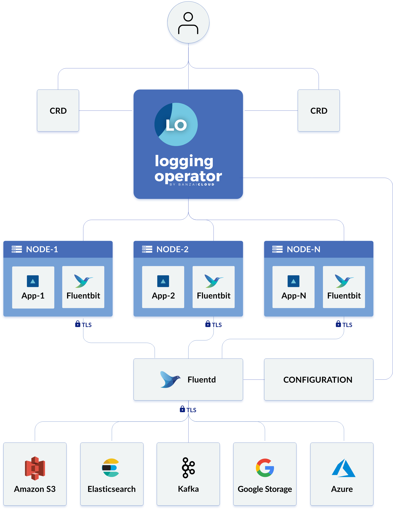
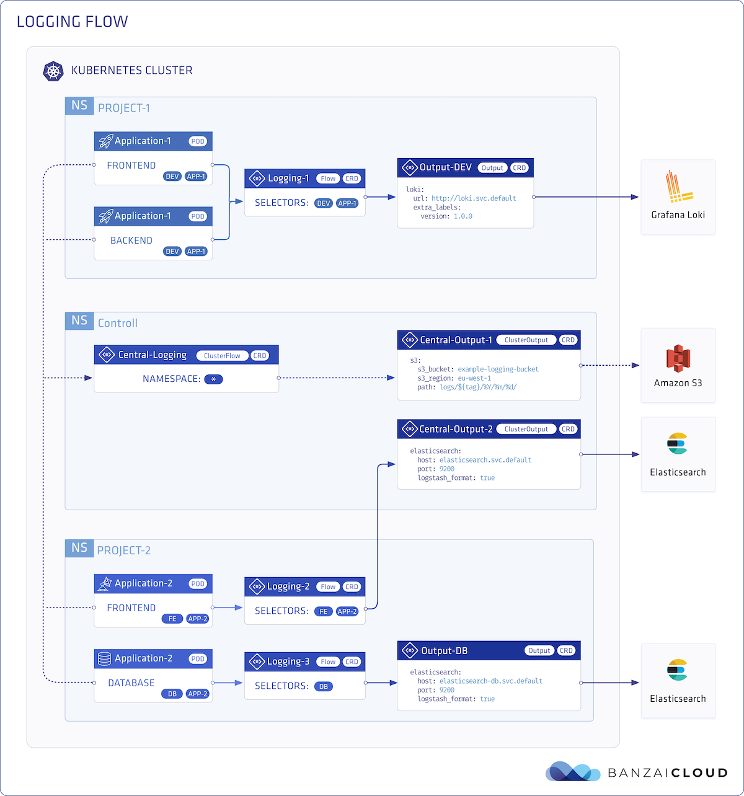

  

  

  

  

  

# Logging operator

Logging operator for Kubernetes based on Fluentd and Fluent-bit.

The Logging operator automates the deployment and configuration of a Kubernetes logging pipeline. The operator deploys and configures a Fluent Bit daemonset on every node to collect container and application logs from the node file system. Fluent Bit queries the Kubernetes API and enriches the logs with metadata about the pods, and transfers both the logs and the metadata to Fluentd. Fluentd receives, filters, and transfer logs to multiple outputs. Your logs will always be transferred on authenticated and encrypted channels.

## What is this operator for?

This operator helps you bundle logging information with your applications: you can describe the behavior of your application in its charts, the Logging operator does the rest.

## Feature highlights

- [x] Namespace isolation
- [x] Native Kubernetes label selectors
- [x] Secure communication (TLS)
- [x] Configuration validation
- [x] Multiple flow support (multiply logs for different transformations)
- [x] Multiple [output](docs/plugins/outputs) support (store the same logs in multiple storage: S3, GCS, ES, Loki and more...)
- [x] Multiple logging system support (multiple fluentd, fluent-bit deployment on the same cluster)

## Architecture

You can define `outputs` (destinations where you want to send your log messages, for example, Elasticsearch, or and Amazon S3 bucket), and `flows` that use filters and selectors to route log messages to the appropriate outputs. You can also define cluster-wide outputs and flows, for example, to use a centralized output that namespaced users cannot modify.

You can configure the Logging operator using the following Custom Resource Descriptions.

- [logging](/docs/crds.md#loggings) - Represents a logging system. Includes `Fluentd` and `Fluent-bit` configuration. Specifies the `controlNamespace`. Fluentd and Fluent-bit will be deployed in the `controlNamespace`
- [output](/docs/crds.md#outputs-clusteroutputs) - Defines an Output for a logging flow. This is a namespaced resource. See also `clusteroutput`.
- [flow](/docs/crds.md#flows-clusterflows) - Defines a logging flow with `filters` and `outputs`. You can specify `selectors` to filter logs by labels. Outputs can be `output` or `clusteroutput`.  This is a namespaced resource. See also `clusterflow`.
- [clusteroutput](/docs/crds.md#outputs-clusteroutputs) - Defines an output without namespace restriction. Only effective in `controlNamespace`.
- [clusterflow](/docs/crds.md#flows-clusterflows) - Defines a logging flow without namespace restriction.

See the [detailed CRD documentation](https://banzaicloud.com/docs/one-eye/logging-operator/crds/).

## Quickstart

Follow these [quickstart guides](https://banzaicloud.com/docs/one-eye/logging-operator/quickstarts/) to try out the Logging operator!

### Install

Deploy Logging Operator with [Kubernetes manifests](https://banzaicloud.com/docs/one-eye/logging-operator/deploy/) or [Helm chart](https://banzaicloud.com/docs/one-eye/logging-operator/deploy/#deploy-logging-operator-with-helm).

> Caution: The **master branch** is under heavy development. Use [releases](https://github.com/banzaicloud/logging-operator/releases) instead of the master branch to get stable software.

## Support

If you are using the Logging operator in a production environment and [require commercial support, contact Banzai Cloud](https://banzaicloud.com/contact/), the company backing the development of the Logging operator. If you are looking for the ultimate observability tool for multi-cluster Kubernetes infrastructures to automate the collection, correlation, and storage of logs and metrics, check out [One Eye](https://banzaicloud.com/products/one-eye/).

If you encounter any problems that the documentation does not address, [open an issue](https://github.com/banzaicloud/logging-operator/issues) or talk to us on the Banzai Cloud Slack channel [#logging-operator](https://pages.banzaicloud.com/invite-slack).

## Documentation

 You can find the complete documentation of the Logging operator on the [Banzai Cloud Documentation Page](https://banzaicloud.com/docs/one-eye/logging-operator) :blue_book:  

## Contributing

If you find this project useful, help us:

- Support the development of this project and star this repo! :star:
- If you use the Logging operator in a production environment, add yourself to the list of production [adopters](https://github.com/banzaicloud/logging-operator/blob/master/ADOPTERS.md).:metal:   
- Help new users with issues they may encounter :muscle:
- Send a pull request with your new features and bug fixes :rocket: 

*For more information, read the [developer documentation](https://banzaicloud.com/docs/one-eye/logging-operator/developers)*.

## License

Copyright (c) 2017-2020 [Banzai Cloud, Inc.](https://banzaicloud.com)

Licensed under the Apache License, Version 2.0 (the "License");
you may not use this file except in compliance with the License.
You may obtain a copy of the License at

[http://www.apache.org/licenses/LICENSE-2.0](http://www.apache.org/licenses/LICENSE-2.0)

Unless required by applicable law or agreed to in writing, software
distributed under the License is distributed on an "AS IS" BASIS,
WITHOUT WARRANTIES OR CONDITIONS OF ANY KIND, either express or implied.
See the License for the specific language governing permissions and
limitations under the License.
