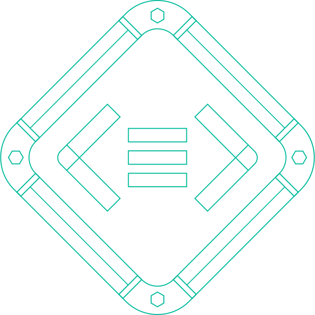

<p align="center"></p>
<p align="center">

  <a href="https://hub.docker.com/r/banzaicloud/logging-operator/">
    
  </a>

  <a href="https://hub.docker.com/r/banzaicloud/logging-operator/">
    
  </a>

  <a href="https://circleci.com/gh/banzaicloud/logging-operator">
    
  </a>

  <a href="https://goreportcard.com/badge/github.com/banzaicloud/logging-operator">
    
  </a>

  <a href="https://github.com/banzaicloud/logging-operator/">
    
  </a>

</p>


# logging-operator v2

Logging operator for Kubernetes based on Fluentd and Fluent-bit.


## What is this operator for?

This operator helps you to pack together logging information with your applications. With the help of Custom Resource Definition you can describe the behaviour of your application within its charts. The operator does the rest.

<p align="center"></p>

### Motivation

The logging operator automates the deployment and configuration of a Kubernetes logging pipeline. Under the hood the operator configures a fluent-bit daemonset for collecting container logs from the node file system. Fluent-bit enriches the logs with Kubernetes metadata and transfers them to fluentd. Fluentd receives, filters and transfer logs to multiple outputs. Your logs will always be transferred on authenticated and encrypted channels.

##### Blogs
  - [Logging-Operator v2](https://banzaicloud.com/blog/logging-operator-v2/) (soon)

##### Blogs (general logging and operator v1)
  - [Advanced logging on Kubernetes](https://banzaicloud.com/blog/k8s-logging-advanced/)
  - [Secure logging on Kubernetes with Fluentd and Fluent Bit](https://banzaicloud.com/blog/k8s-logging-tls/)
  - [Centralized logging under Kubernetes](https://banzaicloud.com/blog/k8s-logging/)
  - [Centralized logging on Kubernetes automated](https://banzaicloud.com/blog/k8s-logging-operator/)
  - [And more...](https://banzaicloud.com/tags/logging/)


Logging-operator is a core part of the [Pipeline](https://beta.banzaicloud.io) platform, a Cloud Native application and devops platform that natively supports multi- and hybrid-cloud deployments with multiple authentication backends. Check out the developer beta:
 <p align="center">
   <a href="https://beta.banzaicloud.io">
   
   </a>
 </p>

## Architecture

Available custom resources:
- [logging](/docs/crds.md#loggings) - Represents a logging system. Includes `Fluentd` and `Fluent-bit` configuration. Specifies the `controlNamespace`. Fluentd and Fluent-bit will be deployed in the `controlNamespace`
- [output](/docs/crds.md#outputs-clusteroutputs) - Defines an Output for a logging flow. This is a namespaced resource.
- [flow](/docs/crds.md#flows-clusterflows) - Defines a logging flow with `filters` and `outputs`. You can specify `selectors` to filter logs by labels. Outputs can be `output` or `clusteroutput`.  This is a namespaced resource.
- [clusteroutput](/docs/crds.md#outputs-clusteroutputs) - Defines an output without namespace restriction. Only effective in `controlNamespace`.
- [clusterflow](/docs/crds.md#flows-clusterflows) - Defines a logging flow without namespace restriction.

The detailed CRD documentation can be found [here](/docs/crds.md).

<p align="center"></p>

*connection between custom resources*

---

## Contents
- Installation
  - [Deploy with Helm](#deploying-with-helm-chart)
- [Supported Plugins](#supported-plugins)
- Examples
  - [S3 Output](./docs/example-s3.md)
  - [Elasticsearch Output](./docs/example-es.md)
- [Troubleshooting](#troubleshooting)
- [Contributing](#contributing)
---


## Deploying with helm chart
The following steps set up an example configuration for sending nginx logs to S3.


#### Add BanzaiCloud chart repository:
```bash
$ helm repo add banzaicloud-stable https://kubernetes-charts.banzaicloud.com
$ helm repo update
```

#### Install logging-operator chart
```bash
$ helm install banzaicloud-stable/logging-operator
```

---

## Supported Plugins

For complete list of supported plugins pleas checkl the [plugins index](/docs/plugins/index.md).

| Name                                            |  Type  |                                Description                                | Status  | Version                                                                                           |
|---------------------------------------------------------|:------:|:-------------------------------------------------------------------------:|---------|-------------------------------------------------------------------------------------------|
| [Alibaba](./docs/plugins/outputs/oss.md)                 | Output | Store logs the Alibaba Cloud Object Storage Service                       |    GA   | [0.0.1](https://github.com/aliyun/fluent-plugin-oss)                                     |
| [Amazon S3](./docs/plugins/outputs/s3.md)                | Output | Store logs in Amazon S3                                                   |    GA   | [1.1.10](https://github.com/fluent/fluent-plugin-s3/releases/tag/v1.1.10)                |
| [Azure](./docs/plugins/outputs/azurestore.md)            | Output | Store logs in Azure Storega                                               |    GA   | [0.1.1](https://github.com/htgc/fluent-plugin-azurestorage/releases/tag/v0.1.0)          |
| [Google Storage](./docs/plugins/outputs/gcs.md)          | Output | Store logs in Google Cloud Storage                                        |    GA   | [0.4.0.beta1](https://github.com/banzaicloud/fluent-plugin-gcs)                          |
| [Grafana Loki](./docs/plugins/outputs/loki.md)           | Output | Transfer logs to Loki                                                     | Testing | [0.2](https://github.com/banzaicloud/fluent-plugin-kubernetes-loki/releases/tag/v0.2)    |
| [ElasticSearch](./docs/plugins/outputs/elasticsearch.md) | Output | Send your logs to Elasticsearch                                           |    GA   | [3.5.5](https://github.com/uken/fluent-plugin-elasticsearch/releases/tag/v3.5.5)         |
| [Sumologic](./docs/plugins/outputs/sumologic.md) | Output | Send your logs to Sumologic                                           |    GA   | [1.5.0](https://github.com/SumoLogic/fluentd-output-sumologic/releases/tag/1.5.0)         |
| [Tag Normaliser](./docs/plugins/filters/tagnormaliser.md) | Parser | Normalise tags for outputs                                                |    GA   |                                                                                          |
| [Parser](./docs/plugins/filters/parser.md)                | Parser | Parse logs with parser plugin                                             |    GA   |                                                                                          |

---

## Troubleshooting

If you encounter any problems that the documentation does not address, please [file an issue](https://github.com/banzaicloud/logging-operator/issues) or talk to us on the Banzai Cloud Slack channel [#logging-operator](https://slack.banzaicloud.io/).

## Contributing

If you find this project useful here's how you can help:

- Send a pull request with your new features and bug fixes
- Help new users with issues they may encounter
- Support the development of this project and star this repo!

For more information please read the [developer documentation](./docs/developers.md)

## License

Copyright (c) 2017-2019 [Banzai Cloud, Inc.](https://banzaicloud.com)

Licensed under the Apache License, Version 2.0 (the "License");
you may not use this file except in compliance with the License.
You may obtain a copy of the License at

[http://www.apache.org/licenses/LICENSE-2.0](http://www.apache.org/licenses/LICENSE-2.0)

Unless required by applicable law or agreed to in writing, software
distributed under the License is distributed on an "AS IS" BASIS,
WITHOUT WARRANTIES OR CONDITIONS OF ANY KIND, either express or implied.
See the License for the specific language governing permissions and
limitations under the License.
