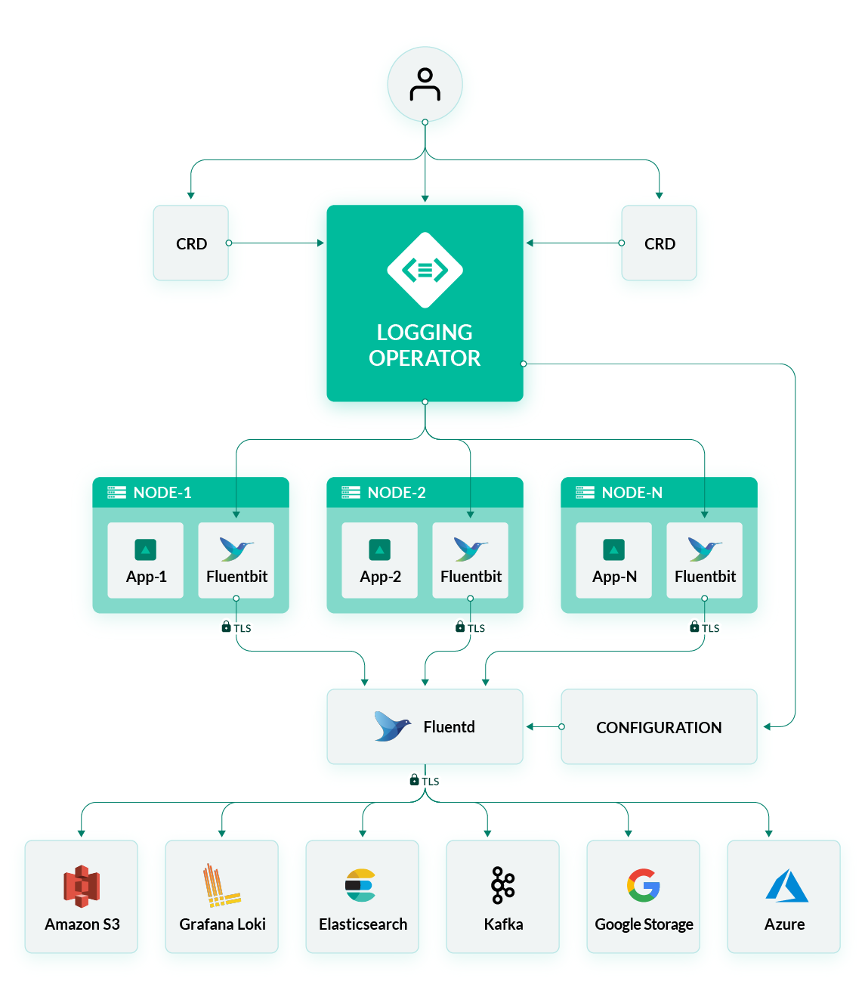
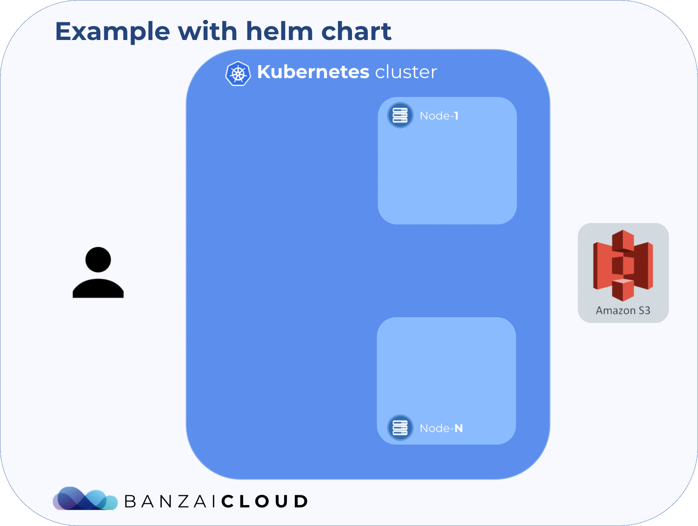

<p align="center"></p>
<p align="center">

  <a href="https://hub.docker.com/r/banzaicloud/logging-operator/">
    
  </a>

  <a href="https://hub.docker.com/r/banzaicloud/logging-operator/">
    
  </a>

  <a href="https://circleci.com/gh/banzaicloud/logging-operator">
    
  </a>

  <a href="https://goreportcard.com/badge/github.com/banzaicloud/logging-operator">
    
  </a>

  <a href="https://github.com/banzaicloud/logging-operator/">
    
  </a>

</p>


# logging-operator

Logging operator for Kubernetes based on Fluentd and Fluent-bit. For more details please follow up with this [post](https://banzaicloud.com/blog/k8s-logging-operator/).


## What is this operator for?

This operator helps you to pack together logging information with your applications. With the help of Custom Resource Definition you can describe the behaviour of your application within its charts. The operator does the rest.

<p align="center"></p>

### Motivation

The logging operator automates the deployment and configuration of a Kubernetes logging pipeline. Under the hood the operator configures a fluent-bit daemonset for collecting container logs from the node file system. Fluent-bit enriches the logs with Kubernetes metadata and transfers them to fluentd. Fluentd receives, filters and transfer logs to multiple outputs. The whole flow can be defined in a single custom resource. Your logs will always be transferred on authenticated and encrypted channels.

##### Blogs
  - [Advanced logging on Kubernetes](https://banzaicloud.com/blog/k8s-logging-advanced/)
  - [Secure logging on Kubernetes with Fluentd and Fluent Bit](https://banzaicloud.com/blog/k8s-logging-tls/)
  - [Centralized logging under Kubernetes](https://banzaicloud.com/blog/k8s-logging/)
  - [Centralized logging on Kubernetes automated](https://banzaicloud.com/blog/k8s-logging-operator/)
  - [And more...](https://banzaicloud.com/tags/logging/)


Logging-operator is a core part of the [Pipeline](https://beta.banzaicloud.io) platform, a Cloud Native application and devops platform that natively supports multi- and hybrid-cloud deployments with multiple authentication backends. Check out the developer beta:
 <p align="center">
   <a href="https://beta.banzaicloud.io">
   
   </a>
 </p>

---

## Contents
- Installation
  - [Deploy with Helm](#deploying-with-helm-chart)
  - [Deploy with Manifest](#deploying-with-kubernetes-manifest)
- [Supported Plugins](#supported-plugins)
- Examples
  - [S3 Output](./docs/examples/s3.md)
  - [Elasticsearch Output](./docs/examples/es.md)
- [Troubleshooting](#troubleshooting)
- [Contributing](#contributing)
---


## Deploying with helm chart
The following steps set up an example configuration for sending nginx logs to S3.


#### Add BanzaiCloud chart repository:
```bash
$ helm repo add banzaicloud-stable https://kubernetes-charts.banzaicloud.com
$ helm repo update
```

#### Install logging-operator chart
```bash
$ helm install banzaicloud-stable/logging-operator
```

#### Install FluentD, FluentBit CRs from chart
```bash
$ helm install banzaicloud-stable/logging-operator-fluent
```
<p align="center"></p>

---

## Deploying with Kubernetes Manifest

```
# Create all the CRDs used by the Operator
kubectl create -f deploy/crds/logging_v1alpha1_plugin_crd.yaml
kubectl create -f deploy/crds/logging_v1alpha1_fluentbit_crd.yaml
kubectl create -f deploy/crds/logging_v1alpha1_fluentd_crd.yaml

# If RBAC enabled create the required resources
kubectl create -f deploy/clusterrole.yaml
kubectl create -f deploy/clusterrole_binding.yaml
kubectl create -f deploy/service_account.yaml

# Create the Operator
kubectl create -f deploy/operator.yaml

# Create the fluent-bit daemonset by submiting a fluent-bit CR
kubectl create -f deploy/crds/logging_v1alpha1_fluentbit_cr.yaml

# Create the fluentd deployment by submitting a fluentd CR
kubectl create -f deploy/crds/logging_v1alpha1_fluentd_cr.yaml

```

## Supported Plugins
| Name                                            |  Type  |                                Description                                | Status  | Version                                                                                  |
|-------------------------------------------------|:------:|:-------------------------------------------------------------------------:|---------|------------------------------------------------------------------------------------------|
| [Alibaba](./docs/plugins/alibaba.md)            | Output | Store logs the Alibaba Cloud Object Storage Service                       |    GA   | [0.0.2](https://github.com/jicong/fluent-plugin-oss)                                     |
| [Amazon S3](./docs/plugins/s3.md)               | Output | Store logs in Amazon S3                                                   |    GA   | [1.1.10](https://github.com/fluent/fluent-plugin-s3/releases/tag/v1.1.10)                |
| [Azure](./docs/plugins/azure.md)                | Output | Store logs in Azure Storega                                               |    GA   | [0.1.1](https://github.com/htgc/fluent-plugin-azurestorage/releases/tag/v0.1.0)          |
| [Google Storage](./docs/plugins/gcs.md)         | Output | Store logs in Google Cloud Storage                                        |    GA   | [0.4.0.beta1](https://github.com/banzaicloud/fluent-plugin-gcs) |
| [Grafana Loki](./docs/plugins/loki.md)          | Output | Transfer logs to Loki                                                     | Testing | [0.2](https://github.com/banzaicloud/fluent-plugin-kubernetes-loki/releases/tag/v0.2)    |
| [ElasticSearch](./docs/plugins/parser.md)       | Output | Send your logs to Elasticsearch                                           |    GA   | [3.5.2](https://github.com/uken/fluent-plugin-elasticsearch/releases/tag/v3.5.2)         |
| [HDFS](https://docs.fluentd.org/output/webhdfs) | Output | Fluentd output plugin to write data into Hadoop HDFS over WebHDFS/HttpFs. |    GA   | [1.2.3](https://github.com/fluent/fluent-plugin-webhdfs/releases/tag/v1.2.3)             |
| Kubernetes Metadata Filter                      | Filter | Filter plugin to add Kubernetes metadata                                  |    GA   | [2.2.0](https://github.com/fabric8io/fluent-plugin-kubernetes_metadata_filter)           |
| [Parser](./docs/plugins/parser.md)              | Parser | Parse logs with parser plugin                                             |    GA   |                                                                                          |
---

## Troubleshooting

If you encounter any problems that the documentation does not address, please [file an issue](https://github.com/banzaicloud/logging-operator/issues) or talk to us on the Banzai Cloud Slack channel [#logging-operator](https://slack.banzaicloud.io/).


## Contributing

If you find this project useful here's how you can help:

- Send a pull request with your new features and bug fixes
- Help new users with issues they may encounter
- Support the development of this project and star this repo!

## License

Copyright (c) 2017-2019 [Banzai Cloud, Inc.](https://banzaicloud.com)

Licensed under the Apache License, Version 2.0 (the "License");
you may not use this file except in compliance with the License.
You may obtain a copy of the License at

[http://www.apache.org/licenses/LICENSE-2.0](http://www.apache.org/licenses/LICENSE-2.0)

Unless required by applicable law or agreed to in writing, software
distributed under the License is distributed on an "AS IS" BASIS,
WITHOUT WARRANTIES OR CONDITIONS OF ANY KIND, either express or implied.
See the License for the specific language governing permissions and
limitations under the License.
