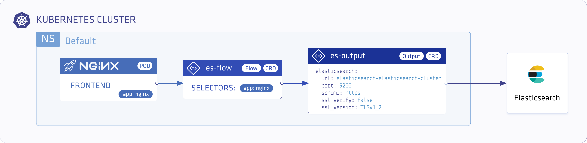
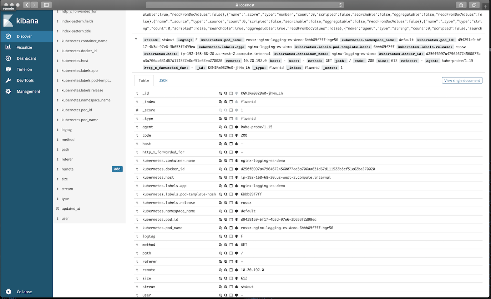

<p align="center"></p>

# Store Nginx Access Logs in ElasticSearch with Logging Operator

<p align="center"></p>

---
## Contents
- **Installation**
  - **ElasticSearch Operator**
    - [Deploy with Kubernetes Manifests](#deploy-elasticsearch)
  - **Logging Operator**
    - [Deploy with Helm](#install-with-helm)
    - [Deploy with Kubernetes Manifests](#install-from-kubernetes-manifests)
  - **Demo Application**  
    - [Deploy with Helm](#demo-app-and-logging-definition)
    - [Deploy with Kubernetes Manifests](#install-from-kubernetes-manifests)
- **Validation**
    - [Cerebro Dashboard](#port-forward-cerebro-dashboard-service)
    - [Kibana Dashboard](#port-forward-kibana-dashboard-service)
---
<br />

## Deploy ElasticSearch

### Install ElasticSearch

We will follow the [Elastic Cloud on Kubernetes quickstart](https://www.elastic.co/guide/en/cloud-on-k8s/current/k8s-quickstart.html)
<br />

Install the operator
```yaml
kubectl apply -f https://download.elastic.co/downloads/eck/1.0.0-beta1/all-in-one.yaml
```

Create `logging` Namespace
```bash
kubectl create ns logging
```

Install the ElasticSearch cluster
```yaml
cat <<EOF | kubectl apply -n logging -f -
apiVersion: elasticsearch.k8s.elastic.co/v1beta1
kind: Elasticsearch
metadata:
  name: quickstart
spec:
  version: 7.5.0
  nodeSets:
  - name: default
    count: 1
    config:
      node.master: true
      node.data: true
      node.ingest: true
      node.store.allow_mmap: false
EOF
```

Install Kibana
```yaml
cat <<EOF | kubectl apply -n logging -f -
apiVersion: kibana.k8s.elastic.co/v1beta1
kind: Kibana
metadata:
  name: quickstart
spec:
  version: 7.5.0
  count: 1
  elasticsearchRef:
    name: quickstart
EOF
```

## Deploy Logging-Operator with Demo Application

### Install with Helm 
#### Add operator chart repository:
```bash
helm repo add banzaicloud-stable https://kubernetes-charts.banzaicloud.com
helm repo update
```
#### Logging Operator
> [How to install Logging-operator with helm](./deploy/README.md#deploy-logging-operator-with-helm)

#### Demo App and Logging Definition
```bash
helm install --namespace logging --name logging-demo banzaicloud-stable/logging-demo \
  --set "elasticsearch.enabled=True"
```

---
<br />

### Install from Kubernetes manifests
#### Logging Operator
> [How to install Logging-operator from manifests](./deploy/README.md#deploy-logging-operator-from-kubernetes-manifests)

#### Create `logging` resource
```bash
kubectl -n logging apply -f - <<"EOF" 
apiVersion: logging.banzaicloud.io/v1beta1
kind: Logging
metadata:
  name: default-logging-simple
spec:
  fluentd: {}
  fluentbit: {}
  controlNamespace: logging
EOF
```
> Note: `ClusterOutput` and `ClusterFlow` resource will only be accepted in the `controlNamespace` 


#### Create an ElasticSearch `output` definition 
```bash
kubectl -n logging apply -f - <<"EOF" 
apiVersion: logging.banzaicloud.io/v1beta1
kind: Output
metadata:
  name: es-output
spec:
  elasticsearch:
    host: quickstart-es-http.logging.svc.cluster.local
    port: 9200
    scheme: https
    ssl_verify: false
    ssl_version: TLSv1_2
    user: elastic
    password:
      valueFrom:
        secretKeyRef:
          name: quickstart-es-elastic-user
          key: elastic
    buffer:
      timekey: 1m
      timekey_wait: 30s
      timekey_use_utc: true
EOF
```
> Note: For production set-up we recommend using longer `timekey` interval to avoid generating too many object.

#### Create `flow` resource
```bash
kubectl -n logging apply -f - <<"EOF" 
apiVersion: logging.banzaicloud.io/v1beta1
kind: Flow
metadata:
  name: es-flow
spec:
  filters:
    - tag_normaliser: {}
    - parser:
        remove_key_name_field: true
        reserve_data: true
        parse:
          type: nginx
  selectors:
    app: nginx
  outputRefs:
    - es-output
EOF
```

#### Install demo application 
```bash
kubectl -n logging apply -f - <<"EOF" 
apiVersion: apps/v1 
kind: Deployment
metadata:
  name: nginx-deployment
spec:
  selector:
    matchLabels:
      app: nginx
  replicas: 1
  template:
    metadata:
      labels:
        app: nginx
    spec:
      containers:
      - name: nginx
        image: banzaicloud/loggen:latest
EOF
```

## Deployment Validation

#### Port Forward Kibana Dashboard Service

Use the user `elastic` and get the password using the following command:
```bash
kubectl -n logging get secret quickstart-es-elastic-user -o=jsonpath='{.data.elastic}' | base64 --decode
```

```bash
kubectl -n logging port-forward svc/quickstart-kb-http 5601
```
Kibana dashboard URL: [https://localhost:5601](https://localhost:5601)

<p align="center"></p>


