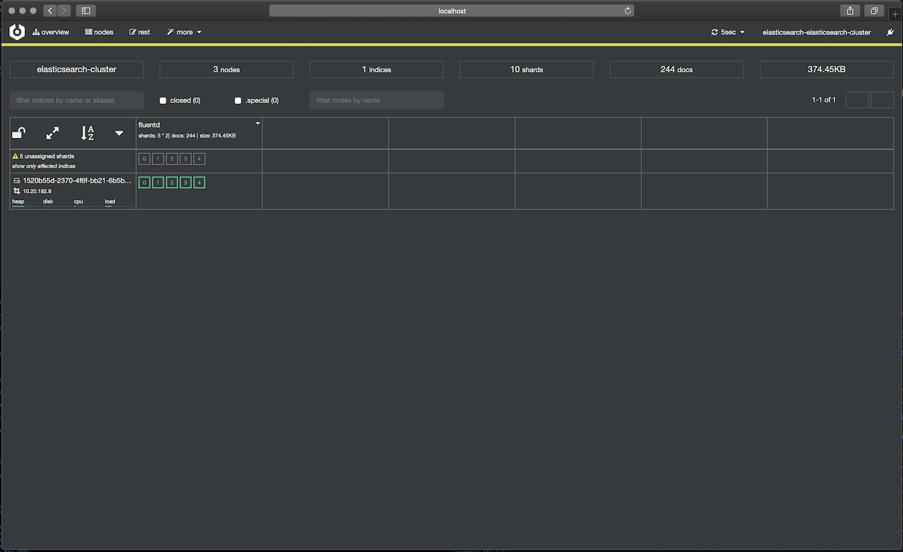

<p align="center"></p>

# Store Nginx Access Logs in ElasticSearch with Logging Operator

<p align="center"></p>

### Add operator chart repository:
```bash
helm repo add es-operator https://raw.githubusercontent.com/upmc-enterprises/elasticsearch-operator/master/charts/
helm repo add banzaicloud-stable https://kubernetes-charts.banzaicloud.com
helm repo update
```

### Install ElasticSearch with operator
```bash
helm install --name elasticsearch-operator es-operator/elasticsearch-operator --set rbac.enabled=True
helm install --name elasticsearch es-operator/elasticsearch --set kibana.enabled=True --set cerebro.enabled=True
```
> [Elasticsearch Operator Documentation](https://github.com/upmc-enterprises/elasticsearch-operator)

## Install with Helm 
### Logging Operator
```bash
helm install --name logging banzaicloud-stable/logging-operator
```
> You can install `logging` resource via [Helm chart](/charts/logging-operator-logging) with built-in TLS generation.

### Nginx App + Logging Definition
```bash
helm install --name nginx-demo banzaicloud-stable/nginx-logging-es-demo
```

## Install from manifest

#### Create `logging` resource
```bash
cat <<EOF | kubectl apply -f -
apiVersion: logging.banzaicloud.io/v1beta1
kind: Logging
metadata:
  name: default-logging-simple
spec:
  fluentd: {}
  fluentbit: {}
  controlNamespace: default
EOF
```

> Note: `ClusterOutput` and `ClusterFlow` resource will only be accepted in the `controlNamespace` 


#### Create an ElasticSearch output definition 
```bash
cat <<EOF | kubectl apply -f -
apiVersion: logging.banzaicloud.io/v1beta1
kind: Output
metadata:
  name: es-output
  namespace: default
spec:
  elasticsearch:
    host: elasticsearch-elasticsearch-cluster.default.svc.cluster.local
    port: 9200
    scheme: https
    ssl_verify: false
    ssl_version: TLSv1_2
    buffer:
      path: /tmp/buffer
      timekey: 1m
      timekey_wait: 30s
      timekey_use_utc: true
EOF
```
> Note: For production set-up we recommend using longer `timekey` interval to avoid generating too many object.

#### Create `flow` resource
```bash
cat <<EOF | kubectl apply -f -
apiVersion: logging.banzaicloud.io/v1beta1
kind: Flow
metadata:
  name: es-flow
  namespace: default
spec:
  filters:
    - tag_normaliser: {}
    - parser:
        key_name: message
        remove_key_name_field: true
        reserve_data: true
        parsers:
          - type: nginx
  selectors:
    app: nginx
  outputRefs:
    - es-output
EOF
```

#### Install nginx deployment
```bash
cat <<EOF | kubectl apply -f -
apiVersion: apps/v1 
kind: Deployment
metadata:
  name: nginx-deployment
spec:
  selector:
    matchLabels:
      app: nginx
  replicas: 1
  template:
    metadata:
      labels:
        app: nginx
    spec:
      containers:
      - name: nginx
        image: nginx:latest
        ports:
        - containerPort: 80
          name: http
          protocol: TCP
        livenessProbe:
          failureThreshold: 3
          httpGet:
            path: /
            port: http
            scheme: HTTP
          periodSeconds: 10
          successThreshold: 1
          timeoutSeconds: 1
        readinessProbe:
          failureThreshold: 3
          httpGet:
            path: /
            port: http
            scheme: HTTP
          periodSeconds: 10
          successThreshold: 1
          timeoutSeconds: 1
EOF
```

#### Forward Cerebro Dashboard
```bash
kubectl port-forward svc/cerebro-elasticsearch-cluster 9001:80
```
[Dashboard URL: http://localhost:9001](http://localhost:9001)

<p align="center"></p>


#### Forward Kibana Dashboard
```bash
kubectl port-forward svc/kibana-elasticsearch-cluster 5601:80
```
[Dashboard URL: https://localhost:5601](https://localhost:5601)

<p align="center"></p>


