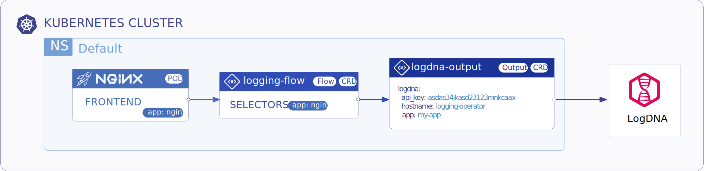
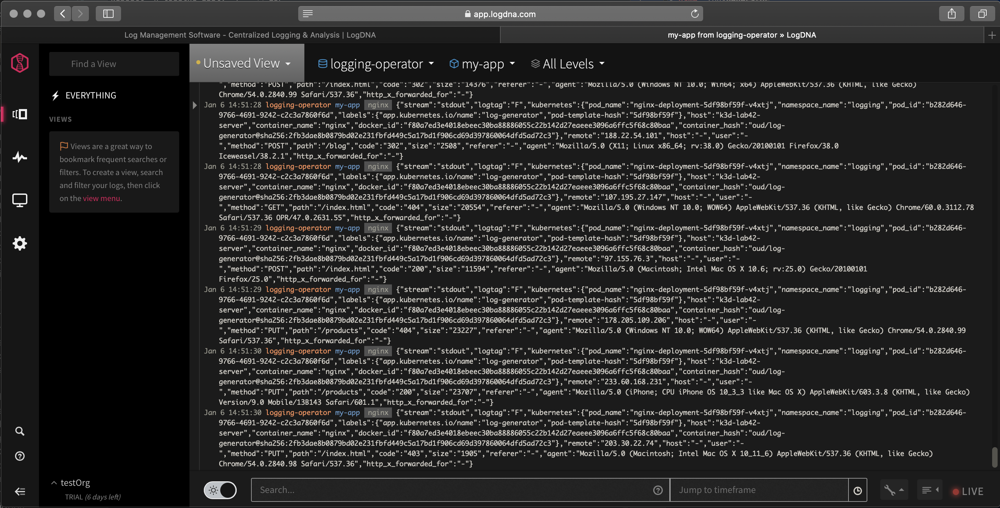

<p align="center"></p>

# Store Nginx Access Logs in LogDNA with Logging Operator

<p align="center"></p>

---
## Contents
- **Installation**
  - **Logging Operator**
    - [Deploy with Helm](#install-with-helm)
    - [Deploy with Kubernetes Manifests](#install-from-kubernetes-manifests)
  - **Demo Application**  
    - [Deploy with Helm](#demo-app-and-logging-definition)
    - [Deploy with Kubernetes Manifests](#install-from-kubernetes-manifests)
- **Validation**
    - [LogDNA Dashboard](#logdna-dashboard)
---
<br />

## Deploy Logging-Operator with Demo Application

### Install with Helm 
#### Add operator chart repository:
```bash
helm repo add banzaicloud-stable https://kubernetes-charts.banzaicloud.com
helm repo update
```
#### Logging Operator
> [How to install Logging-operator with helm](./deploy/README.md#deploy-logging-operator-with-helm)

#### Demo App and Logging Definition
```bash
helm install --namespace logging --name logging-demo banzaicloud-stable/logging-demo \
 --set "logdna.enabled=True" \
 --set "logdna.api_key=" \
 --set "logdna.app=" \
 --set "logdna.hostname=" 
```
---
<br />


### Install from Kubernetes manifests
#### Logging Operator
> [How to install Logging-operator from manifests](./deploy/README.md#deploy-logging-operator-from-kubernetes-manifests)

#### Create `logging` Namespace
```bash
kubectl create ns logging
```

#### Create `logging` resource
```bash
kubectl -n logging apply -f - <<"EOF" 
apiVersion: logging.banzaicloud.io/v1beta1
kind: Logging
metadata:
  name: demo-logging
spec:
  fluentd: {}
  fluentbit: {}
  controlNamespace: logging
EOF
```
> Note: `ClusterOutput` and `ClusterFlow` resource will only be accepted in the `controlNamespace` 


#### Create a LogDNA `Output` Definition 
```bash
kubectl -n logging apply -f - <<"EOF" 
apiVersion: logging.banzaicloud.io/v1beta1
kind: Output
metadata:
  name: logdna-output
  namespace: logging
spec:
  logdna:
    api_key: demoa0315076d75234133124fd2f583demo
    hostname: logging-operator
    app: my-app
EOF
```

#### Create `flow` resource
```bash
kubectl -n logging apply -f - <<"EOF" 
apiVersion: logging.banzaicloud.io/v1beta1
kind: Flow
metadata:
  name: nginx-log-to-logdna
spec:
  filters:
    - tag_normaliser: {}
    - parser:
        remove_key_name_field: true
        reserve_data: true
        parsers:
          - type: nginx
  selectors:
    app.kubernetes.io/name: log-generator
  outputRefs:
    - logdna-output
EOF
```

#### Install Demo Deployment
```bash
kubectl -n logging apply -f - <<"EOF" 
apiVersion: apps/v1 
kind: Deployment
metadata:
  name: log-generator
spec:
  selector:
    matchLabels:
      app.kubernetes.io/name: log-generator
  replicas: 1
  template:
    metadata:
      labels:
        app.kubernetes.io/name: log-generator
    spec:
      containers:
      - name: nginx
        image: banzaicloud/log-generator:0.3.2
EOF
```

## LogDNA Dashboard
<p align="center"></p>


