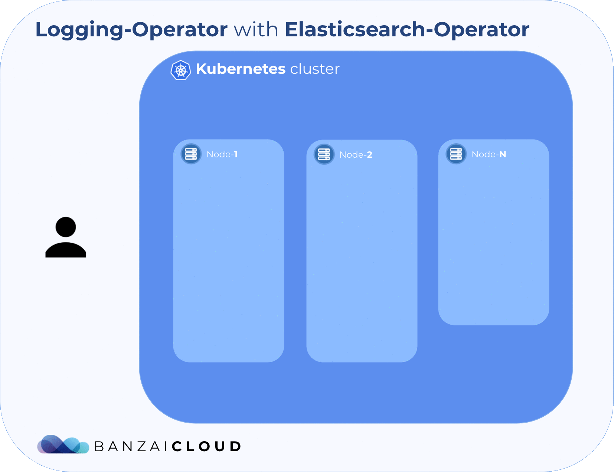

<p align="center"></p>

## Example Logging-operator with Elasticsearch Operator
<p align="center"></p>


#### Add operator chart repository:
```bash
$ helm repo add es-operator https://raw.githubusercontent.com/upmc-enterprises/elasticsearch-operator/master/charts/
$ helm repo add banzaicloud-stable https://kubernetes-charts.banzaicloud.com
$ helm repo update
```

#### Install operators
```bash
$ helm install --name elasticsearch-operator es-operator/elasticsearch-operator --set rbac.enabled=True
$ helm install --name elasticsearch es-operator/elasticsearch --set kibana.enabled=True --set cerebro.enabled=True
$ helm install --name loggingo banzaicloud-stable/logging-operator
```
> [Elasticsearch Operator Documentation](https://github.com/upmc-enterprises/elasticsearch-operator)

#### Install Nginx Demo chart
```bash
$ helm install banzaicloud-stable/nginx-logging-es-demo
```

#### Forward cerebro & kibana dashboards
```bash
$ kubectl port-forward svc/cerebro-elasticsearch-cluster 9001:80
$ kubectl port-forward svc/kibana-elasticsearch-cluster 5601:80
```

[](https://asciinema.org/a/9EcfIzlUQJSjJdopEh5HCU7OT)

## License

Copyright (c) 2017-2019 [Banzai Cloud, Inc.](https://banzaicloud.com)

Licensed under the Apache License, Version 2.0 (the "License");
you may not use this file except in compliance with the License.
You may obtain a copy of the License at

[http://www.apache.org/licenses/LICENSE-2.0](http://www.apache.org/licenses/LICENSE-2.0)

Unless required by applicable law or agreed to in writing, software
distributed under the License is distributed on an "AS IS" BASIS,
WITHOUT WARRANTIES OR CONDITIONS OF ANY KIND, either express or implied.
See the License for the specific language governing permissions and
limitations under the License.
