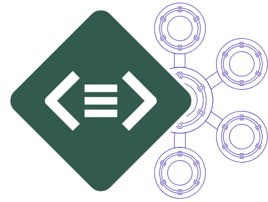
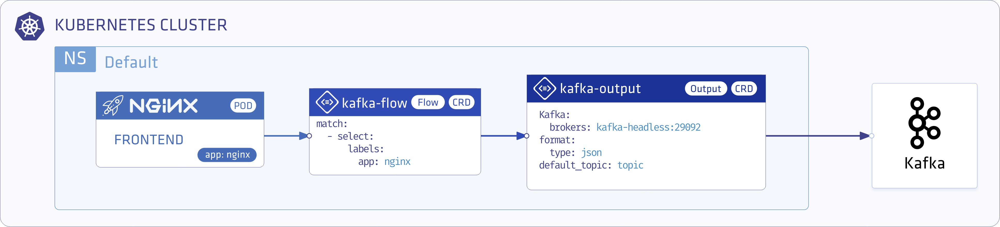

<p align="center"></p>

# Transport Nginx Access Logs into Kafka with Logging Operator

<p align="center"></p>

---
## Contents
- **Installation**
  - **Kafka** 
    - [Deploy with Helm](#deploy-kafka)
  - **Logging Operator**
    - [Deploy with Helm](#install-with-helm)
    - [Deploy with Kubernetes Manifests](#install-from-kubernetes-manifests)
  - **Demo Application**  
    - [Deploy with Helm](#demo-app-and-logging-definition)
    - [Deploy with Kubernetes Manifests](#install-from-kubernetes-manifests)
- **Validation**
    - [Kafkacat](#test-your-deployment-with-kafkacat)
---
<br />

## Deploy Kafka
>In this demo we are using our kafka operator.
> [Easy Way Installing with Helm](https://github.com/banzaicloud/kafka-operator#easy-way-installing-with-helm)
<br />


## Deploy Logging-Operator with Demo Application

### Install with Helm 
#### Add operator chart repository:
```bash
helm repo add banzaicloud-stable https://kubernetes-charts.banzaicloud.com
helm repo update
```
#### Logging Operator
> [How to install Logging-operator with helm](../deploy/README.md#deploy-logging-operator-with-helm)

#### Demo App and Logging Definition
```bash
helm install --namespace logging --name logging-demo banzaicloud-stable/logging-demo \
 --set "kafka.enabled=True" 
```

---
<br />

### Install from Kubernetes manifests
#### Logging Operator
> [How to install Logging-operator from manifests](../deploy/README.md#deploy-logging-operator-from-kubernetes-manifests)

#### Create `logging` Namespace
```bash
kubectl create ns logging
```

#### Create `logging` resource
```bash
kubectl -n logging apply -f - <<"EOF" 
apiVersion: logging.banzaicloud.io/v1beta1
kind: Logging
metadata:
  name: default-logging-simple
spec:
  fluentd: {}
  fluentbit: {}
  controlNamespace: logging
EOF
```

> Note: `ClusterOutput` and `ClusterFlow` resource will only be accepted in the `controlNamespace` 


#### Create an Kafka `output` definition 
```bash
kubectl -n logging apply -f - <<"EOF" 
apiVersion: logging.banzaicloud.io/v1beta1
kind: Output
metadata:
  name: kafka-output
spec:
  kafka:
    brokers: kafka-headless.kafka.svc.cluster.local:29092
    default_topic: topic
    format: 
      type: json    
    buffer:
      tags: topic
      timekey: 1m
      timekey_wait: 30s
      timekey_use_utc: true
EOF
```
> Note: For production set-up we recommend using longer `timekey` interval to avoid generating too many object.

#### Create `flow` resource
```bash
kubectl -n logging apply -f - <<"EOF" 
apiVersion: logging.banzaicloud.io/v1beta1
kind: Flow
metadata:
  name: kafka-flow
spec:
  filters:
    - parser:
        remove_key_name_field: true
        reserve_data: true
        parse:
          type: nginx
  selectors:
    app: nginx
  outputRefs:
    - kafka-output
EOF
```
#### Install demo application 
```bash
kubectl -n logging apply -f - <<"EOF" 
apiVersion: apps/v1 
kind: Deployment
metadata:
  name: nginx-deployment
spec:
  selector:
    matchLabels:
      app: nginx
  replicas: 1
  template:
    metadata:
      labels:
        app: nginx
    spec:
      containers:
      - name: nginx
        image: banzaicloud/loggen:latest
EOF
```

## Test Your Deployment with kafkacat
#### Exec Kafaka test pod
```bash
kubectl -n kafka exec -it kafka-test-c sh
```

#### Run kafkacat
```bash
kafkacat -C -b kafka-0.kafka-headless.kafka.svc.cluster.local:29092 -t topic
```

[](https://asciinema.org/a/273236)
