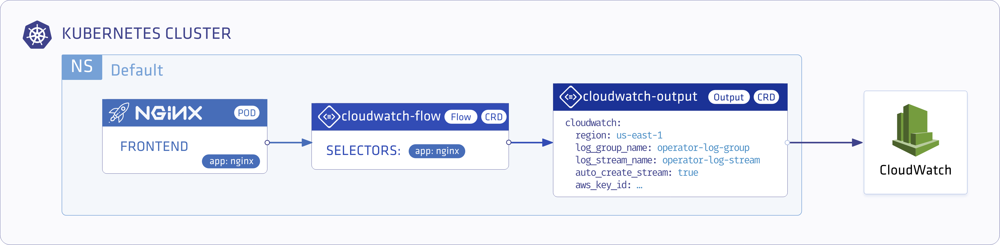
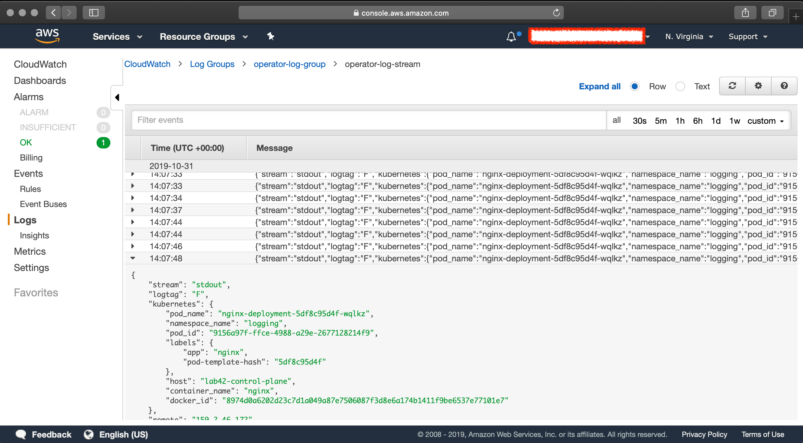

<p align="center"></p>

# Store Nginx Access Logs in Amazon CloudWatch with Logging Operator

<p align="center"></p>

---
## Contents
- **Installation**
  - **Logging Operator**
    - [Deploy with Helm](#install-with-helm)
    - [Deploy with Kubernetes Manifests](#install-from-kubernetes-manifests)
  - **Demo Application**  
    - [Deploy with Helm](#demo-app-and-logging-definition)
    - [Deploy with Kubernetes Manifests](#install-from-kubernetes-manifests)
- **Validation**
    - [CloudWatch Dashboard](#deployment-validation)
---
<br />

## Deploy Logging-Operator with Demo Application

### Install with Helm 
#### Add operator chart repository:
```bash
helm repo add banzaicloud-stable https://kubernetes-charts.banzaicloud.com
helm repo update
```
#### Logging Operator
> [How to install Logging-operator with helm](../deploy/README.md#deploy-logging-operator-with-helm)

#### Demo App and Logging Definition
```bash
helm install --namespace logging --name logging-demo banzaicloud-stable/logging-demo \
 --set "cloudwatch.enabled=True" \
 --set "cloudwatch.aws.secret_key=" \
 --set "cloudwatch.aws.access_key=" \
 --set "cloudwatch.aws.region=" \
 --set "cloudwatch.aws.log_group_name=" \
 --set "cloudwatch.aws.log_stream_name=" 
```


---
<br />


### Install from Kubernetes manifests
#### Logging Operator
> [How to install Logging-operator from manifests](../deploy/README.md#deploy-logging-operator-from-kubernetes-manifests)

#### Create `logging` Namespace
```bash
kubectl create ns logging
```

#### Create `logging` resource
```bash
kubectl -n logging apply -f - <<"EOF" 
apiVersion: logging.banzaicloud.io/v1beta1
kind: Logging
metadata:
  name: demo-logging
spec:
  fluentd: {}
  fluentbit: {}
  controlNamespace: logging
EOF
```
> Note: `ClusterOutput` and `ClusterFlow` resource will only be accepted in the `controlNamespace` 


#### Create AWS secret

> If you have your `$AWS_ACCESS_KEY_ID` and `$AWS_SECRET_ACCESS_KEY` set you can use the following snippet.
```bash
kubectl -n logging create secret generic logging-cloudwatch --from-literal "awsAccessKeyId=$AWS_ACCESS_KEY_ID" --from-literal "awsSecretAccesKey=$AWS_SECRET_ACCESS_KEY"
```
Or set up the secret manually.
```bash
kubectl -n logging apply -f - <<"EOF" 
apiVersion: v1
kind: Secret
metadata:
  name: logging-cloudwatch
type: Opaque
data:
  awsAccessKeyId: <base64encoded>
  awsSecretAccesKey: <base64encoded>
EOF
```


#### Create a CloudWatch `Output` Definition 
```bash
kubectl -n logging apply -f - <<"EOF" 
apiVersion: logging.banzaicloud.io/v1beta1
kind: Output
metadata:
  name: cloudwatch-output
  namespace: logging
spec:
  cloudwatch:
    aws_key_id:
      valueFrom:
        secretKeyRef:
          name: logging-cloudwatch
          key: awsAccessKeyId
    aws_sec_key:
      valueFrom:
        secretKeyRef:
          name: logging-cloudwatch
          key: awsSecretAccesKey
    log_group_name: operator-log-group
    log_stream_name: operator-log-stream
    region: us-east-1
    auto_create_stream: true
    buffer:
      timekey: 30s
      timekey_wait: 30s
      timekey_use_utc: true
EOF
```
> Note: For production set-up we recommend using longer `timekey` interval to avoid generating too many object.

#### Create `flow` resource
```bash
kubectl -n logging apply -f - <<"EOF" 
apiVersion: logging.banzaicloud.io/v1beta1
kind: Flow
metadata:
  name: nginx-log-to-cloudwatch
spec:
  filters:
    - tag_normaliser: {}
    - parser:
        remove_key_name_field: true
        reserve_data: true
        parsers:
          - type: nginx
  selectors:
    app: nginx
  outputRefs:
    - cloudwatch-output
EOF
```

#### Install Nginx Demo Deployment
```bash
kubectl -n logging apply -f - <<"EOF" 
apiVersion: apps/v1 
kind: Deployment
metadata:
  name: nginx-deployment
spec:
  selector:
    matchLabels:
      app: nginx
  replicas: 1
  template:
    metadata:
      labels:
        app: nginx
    spec:
      containers:
      - name: nginx
        image: banzaicloud/loggen:latest
EOF
```

## Deployment Validation
<p align="center"></p>


