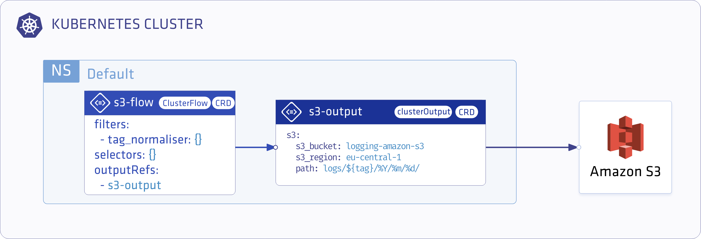

<p align="center"></p>

# Save all logs to Amazon S3

<p align="center"></p>

## Deploy Logging-operator
Before you start, [install the logging-operator](../deploy/README.md#)

## Create default logging
Complete the following steps to configure Logging operator to send your log messages to an Amazon S3 bucket.
1. Create a `logging` resource.
    ```bash
    kubectl -n logging apply -f - <<"EOF" 
    apiVersion: logging.banzaicloud.io/v1beta1
    kind: Logging
    metadata:
      name: default-logging-simple
    spec:
      fluentd: {}
      fluentbit: {}
      controlNamespace: logging
    EOF
    ```
    > Note: The `ClusterOutput` and `ClusterFlow` resources are accepted only in the `controlNamespace`.
1. Create an AWS secret.
If you have your `$AWS_ACCESS_KEY_ID` and `$AWS_SECRET_ACCESS_KEY` set you can use the following snippet.
    ```bash
    kubectl -n logging create secret generic logging-s3 --from-literal "awsAccessKeyId=$AWS_ACCESS_KEY_ID" --from-literal "awsSecretAccesKey=$AWS_SECRET_ACCESS_KEY"
    ```
    Or you can set up the secret manually.
    ```bash
    kubectl -n logging apply -f - <<"EOF" 
    apiVersion: v1
    kind: Secret
    metadata:
      name: logging-s3
    type: Opaque
    data:
      awsAccessKeyId: <base64encoded>
      awsSecretAccesKey: <base64encoded>
    EOF
    ```
    > Caution: You **MUST** install the `secret` and the `output` definition in the **SAME** namespace
1. Create an S3 Output Definition.
    ```bash
    kubectl -n logging apply -f - <<"EOF" 
    apiVersion: logging.banzaicloud.io/v1beta1
    kind: Output
    metadata:
      name: s3-output
      namespace: logging
    spec:
      s3:
        aws_key_id:
          valueFrom:
            secretKeyRef:
              name: logging-s3
              key: awsAccessKeyId
        aws_sec_key:
          valueFrom:
            secretKeyRef:
              name: logging-s3
              key: awsSecretAccesKey
        s3_bucket: logging-amazon-s3
        s3_region: eu-central-1
        path: logs/${tag}/%Y/%m/%d/
        buffer:
          timekey: 10m
          timekey_wait: 30s
          timekey_use_utc: true
    EOF
    ```
    > Note: For production environments we recommend using longer `timekey` interval to avoid generating too many objects.
1. Create a `flow` resource.
The following snippet will use [tag_normaliser](../plugins/filters/tagnormaliser.md) to re-tag the logs and after pushing them to S3.
    ```bash
    kubectl -n logging apply -f - <<"EOF" 
    apiVersion: logging.banzaicloud.io/v1beta1
    kind: Flow
    metadata:
      name: all-log-to-s3
      namespace: logging
    spec:
      filters:
        - tag_normaliser: {}
      selectors: {}
      outputRefs:
        - s3-output
    EOF
    ```
1. Check the output.
The logs will be available in the bucket on a `path` like:
    ```/logs/default.default-logging-simple-fluentbit-lsdp5.fluent-bit/2019/09/11/201909111432_0.gz```
