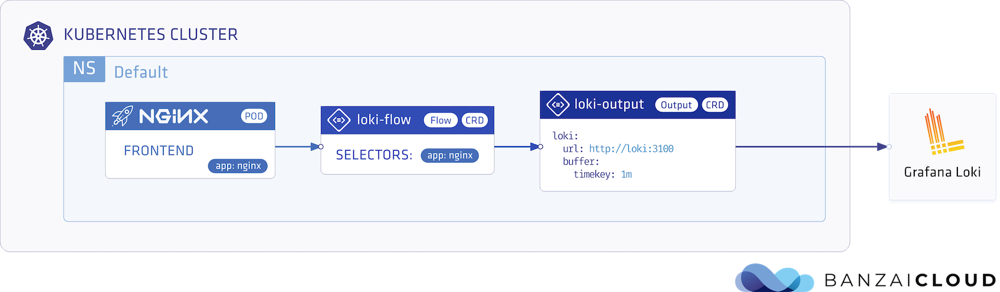
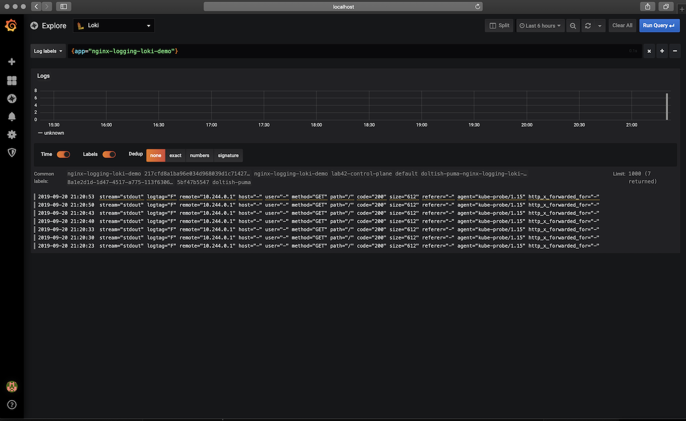

<p align="center"></p>

# Store Nginx Access Logs in Grafana Loki with Logging Operator

<p align="center"></p>

---
## Contents
- **Installation**
  - **Loki**
    - [Deploy with Helm](#deploy-loki-and-grafana)
  - **Logging Operator**
    - [Deploy with Helm](#install-with-helm)
    - [Deploy with Kubernetes Manifests](#install-from-kubernetes-manifests)
  - **Demo Application**  
    - [Deploy with Helm](#demo-app-and-logging-definition)
    - [Deploy with Kubernetes Manifests](#install-from-kubernetes-manifests)
- **Validation**
    - [Grafana Dashboard](#grafana-dashboard)
---

<br />

## Deploy Loki and Grafana

### Add loki chart repository:
```bash
helm repo add loki https://grafana.github.io/loki/charts
helm repo update
```

### Install Loki
```bash
helm install --namespace logging --name loki loki/loki
```
> [Grafana Loki Documentation](https://github.com/grafana/loki/tree/master/production/helm)
### Install Grafana
```bash
helm install --namespace logging --name grafana stable/grafana \
 --set "datasources.datasources\\.yaml.apiVersion=1" \
 --set "datasources.datasources\\.yaml.datasources[0].name=Loki" \
 --set "datasources.datasources\\.yaml.datasources[0].type=loki" \
 --set "datasources.datasources\\.yaml.datasources[0].url=http://loki:3100" \
 --set "datasources.datasources\\.yaml.datasources[0].access=proxy"
```
<br />


## Deploy Logging-Operator with Demo Application

### Install with Helm 
#### Add operator chart repository:
```bash
helm repo add banzaicloud-stable https://kubernetes-charts.banzaicloud.com
helm repo update
```
#### Logging Operator
> [How to install Logging-operator with helm](../deploy/README.md#deploy-logging-operator-with-helm)

#### Demo App and Logging Definition
```bash
helm install --namespace logging --name logging-demo banzaicloud-stable/logging-demo \
 --set "loki.enabled=True" 
```

---
<br />

### Install from Kubernetes manifests
#### Logging Operator
> [How to install Logging-operator from manifests](../deploy/README.md#deploy-logging-operator-from-kubernetes-manifests)

#### Create `logging` Namespace
```bash
kubectl create ns logging
```

#### Create `logging` resource
```bash
kubectl -n logging apply -f - <<"EOF" 
apiVersion: logging.banzaicloud.io/v1beta1
kind: Logging
metadata:
  name: default-logging-simple
spec:
  fluentd: {}
  fluentbit: {}
  controlNamespace: logging
EOF
```
> Note: `ClusterOutput` and `ClusterFlow` resource will only be accepted in the `controlNamespace` 


#### Create an Loki `output` definition 
```bash
kubectl -n logging apply -f - <<"EOF" 
apiVersion: logging.banzaicloud.io/v1beta1
kind: Output
metadata:
  name: loki-output
spec:
  loki:
    url: http://loki:3100
    configure_kubernetes_labels: true
    buffer:
      timekey: 1m
      timekey_wait: 30s
      timekey_use_utc: true
EOF
```
> Note: For production set-up we recommend using longer `timekey` interval to avoid generating too many object.

#### Create `flow` resource
```bash
kubectl -n logging apply -f - <<"EOF" 
apiVersion: logging.banzaicloud.io/v1beta1
kind: Flow
metadata:
  name: loki-flow
spec:
  filters:
    - parser:
        remove_key_name_field: true
        reserve_data: true
        parsers:
          - type: nginx
  selectors:
    app: nginx
  outputRefs:
    - loki-output
EOF
```

#### Install nginx deployment
```bash
kubectl -n logging apply -f - <<"EOF" 
apiVersion: apps/v1 
kind: Deployment
metadata:
  name: nginx-deployment
spec:
  selector:
    matchLabels:
      app: nginx
  replicas: 1
  template:
    metadata:
      labels:
        app: nginx
    spec:
      containers:
      - name: nginx
        image: banzaicloud/loggen:latest
EOF
```

## Deployment Validation

### Grafana Dashboard

#### Get Grafana login credantials
```bash
kubectl -n logging get secrets grafana -o json | jq '.data | map_values(@base64d)'
```

#### Forward Grafana Service
```bash
kubectl -n logging port-forward svc/grafana 3000:80
```
Gradana Dashboard: [http://localhost:3000](http://localhost:3000)
<p align="center"></p>


